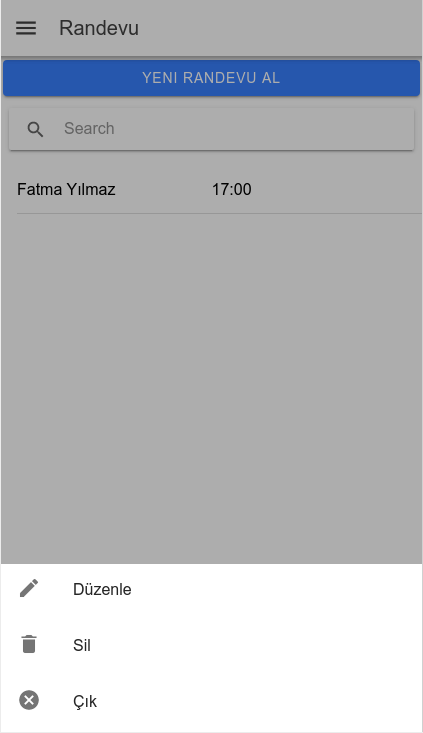

# Hastane Randevu Sistemi

|Öğrenci Adı|Numarası|
|-----------|-----------|
|Görkem Gülmez|160202076|
|Ali Recep Karaca|160202053|
|Kübra Cebbar|160202025|
|Mehmet Fırat Kömürcü|160202028|
|Cihangir İlyas Baştan|160202019|

## Kurulum
> git clone --recurse-submodules -j8 https://github.com/2019-BLM441/app-160202076  
> npm install  
> ionic serve  

## Özelikler
* Sqlite ve firebase ile online offline db erişimi
* Doktor ve hastalar için ayrı giriş ve kayıt olma sistemleri
* Auth modülü
  
## Açıklama
**Giriş ve Üyelik**
Sistemde doktorlar ve hastalar için ayrı giriş ve üyelik sayfaları bulunmaktadır. Genel olarak doktorlar sisteme veri eklerken, hastalar eklenen veriyi okumaktadır. Giriş ve çıkış işlemleri ana sayfadaki butonlar ile yapılmaktadır. Hastalar giriş yapmak için kendi TC kimlik numaralarını kullanmaları gerekirken doktorlar kendi belirledikleri kullanıcı adlarını girerler.

  
__Doktor Kayıt__

  
__Hastalar İçin Giriş Ekranı__

**Randevu  Modülü**  
Randevu modülünde hasta klinik,doktor ve saat seçerek randevu alabilir.Daha sonra alınan randevuyu değiştirebilir veya silebilir.Hasta randevularını randevularım sayfasından görüntüleyebilir. Seçilen doktorun meşgul olduğu saatler kullanıcı tarafından seçilemez.

  
__Randevu alma__

  
__Randevu Düzenle__

  
__Randevu Sil__

**Ameliyat Modulü**  
Ameliyat modülünde hasta olacağı ameliyatı ameliyatlarım sayfasından takip edebilir. Ameliyatı yapacak doktor ameliyatlarını ekleyebilir,silebilir,güncelleyebilir veya kayıt edilen amliyatları listeleyebilir.

  
__Ameliyat Saat Alımı__

  
__Ameliyat Silme__

**İlaç Modülü**  
İlaç modülünde hasta doktorun onun için yazdığı ilaçları ilaçlarım sayfasından takip edebilir.İlacı verecek olan doktor yeni ilaç ekleyebilir, eklenen ilacı silebilir veya güncelleyebilir.

  
__İlaç Görüntüleme__

  
__İlaç Yazma__

**Tahlil Modülü**  
Tahlil modülünde hasta yaptırdığı tahlillerin ne olduğunu tahlillerim ekranından takip edebilir. Doktor her bir hastası için istediği tahlilllerin sonuçlarını ve tahlilllerin türünü görebilir.Yeni tahlil istekleri oluşturabilir.

  
__Tahlil Ekleme__

  
__Tahlil Açıklama__

**Doktor İzin Modülü**  
Doktor bitiş ve başlangıç tarihi seçerek izin almak istediği günleri ekleyebilir ve bu günlerin ücretli izin mi yoksa ücretsiz izin mi olduğunu belirtebilir.

    
__Doktor İzim Sistemi__

   
__Modüller İçin Ayrı DB Tabloları (Firebase)__

### Git komutları
**Clone**  
git clone --recurse-submodules -j8 https://github.com/2019-BLM441/app-160202076

**Pull**  
git pull --recurse-submodules

**Commit**  
cd your_submodule  
git add .  
git commit -a -m "commit in submodule"  
git push  

cd ../../..  
git add your_submodule  
git commit -m "Updated submodule"  